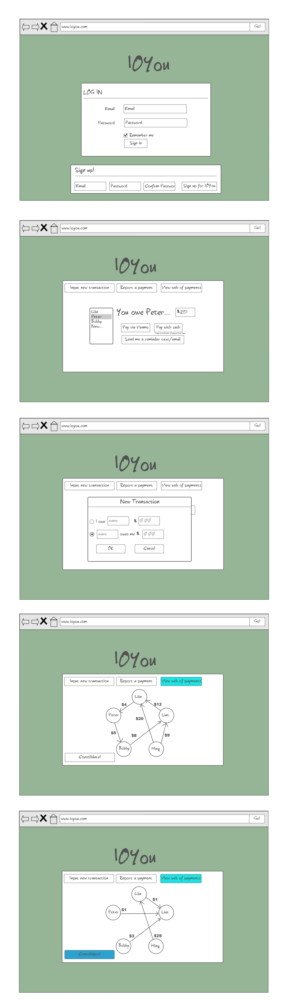

##Project Title: IOYou##

###Problem Statement###
The most difficult part of a night out with friends is splitting the bill. Sometimes a friend will take the bill and everyone pays them back later, hence a network of debts is formed. 

###Solution###
A way to minimize the number of money transfers by consolidating debts within a network of people. 

###Use Scenario###
*A group of 4 friends are paying a bill at the end of the dinner. To save time and headache, Person A pays for the meal and everyone agrees to pay Person A back later.

*For the meal, Person B owes $20, Person C owes $15, and Person D owes $10. 

*However the situation is more complicated. Person A owes Person D $5 for lunch 2 weeks ago. Also, Person D owes Person C $15 for gas money. Several people owe each other money, which could be consolidated.

*After using IOYou, they figured out the real debts. In end, Person B and Person D will each pay $20 to Person A. The new debt information can be sent to the group via email or SMS.

###Features (Pick 5)###
*Send emails / SMS
*Front-end framework
*Server-side data persistence
*Reporting with charts and graphs
*Client-side data persistence

###Data Collected & Used###
*Debts to be optimized
*Facebook login for profile

###Algorithms or Special Techniques###
*Graph Theory to manipulate and consolidate the debts

###APIs###
Facebook API
Google Developer API

###Mock-Ups###
